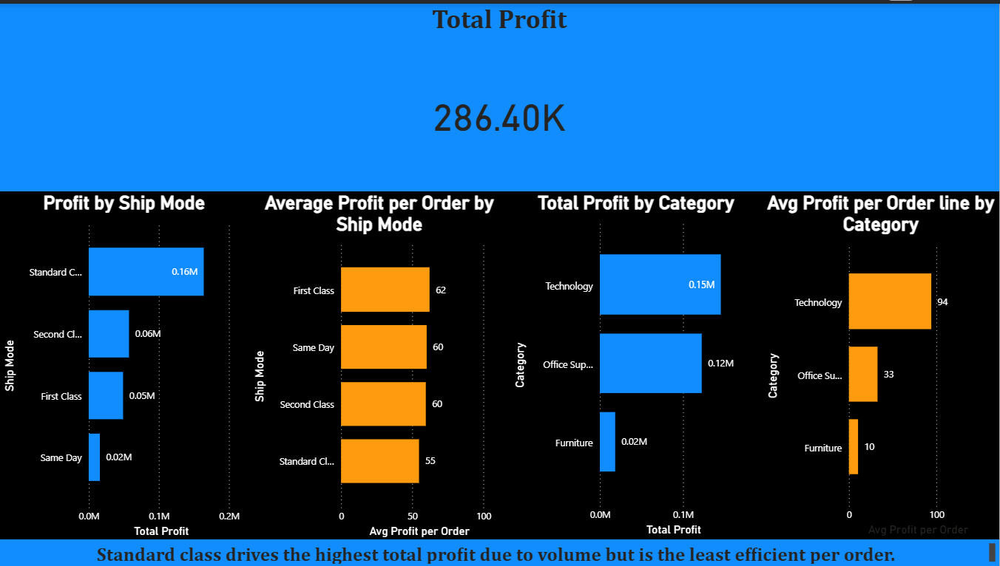
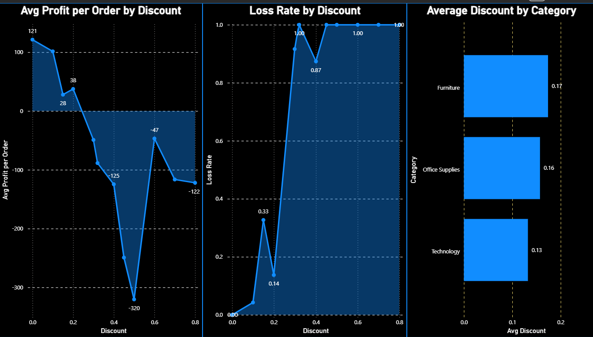

# Superstore Data Analysis

## Key Insight
High discount levels (>30%) are the primary driver of loss making transactions, with the Furniture category being the most affected due to consistently higher discount application.

## Background and business Problem
- This analysis attempts to identify key factors - such as shipping method, discounting, and product category - contributing most to profit erosion in a retail superstore dataset, with a view to generating insights that would lead to recommendations that improve profit efficiency. 

## Dataset Overview
The dataset contains 9,994 order-line records. Each row represents one product within an order as the data grain. The significance is that anaylysis at the order level, as opposed to the order-line level, would require appropriate aggregation to collapse the grain such that one row would represent one order.

## Tools Used
- Excel
- SQL
- Power BI

## Data Preparation
The dataset used was obtained from kaggle, imported into excel and inspected structurally. This included checks for duplicates and missing values in key variables. No significant data quality issues were identified. The next step involved importing it to MySQL and conducting queries to extract insights.

## Analytical approach
The analysis followed a structured approach to identify drivers of profit erosion.
First, the data grain was established at the order-line level, which informed the need to use distinct counts and appropriate aggregation methods when analyzing orders and profitability.
The analysis began with shipping methods to assess differences in volume and efficiency. Total profit and average profit per order were compared to distinguish between high-volume and high-efficiency segments.
Next, discount levels were analyzed by grouping them into consistent ranges. Both average profit and loss rate were evaluated to understand not only how profitability changed with discounting, but also how frequently losses occurred.
Finally, product categories were examined to determine where high discount levels were concentrated and how they related to profitability. This helped identify whether certain categories were disproportionately affected by discount-driven losses.
This stepwise approach allowed for the isolation and validation of key factors contributing to profit erosion.

## Key Findings
Finding 1 — Shipping
 Standard class shipping generates the highest total profit due to its significantly higher shipping volume. However, it records the lowest average profit per order compared to other shipping methods.

Finding 2 — Discounts
	ADiscount levels above approximately 30% are consistently associated with negative profitability, with losses becoming more more frequent and severe at higher discount levels.

Finding 3 — Category Profitability
Furniture receives the highest average discounts amongst all product categories. This category also records the lowest total profit and the lowest average profit per order line.

## Dashboard

### Business Overview

### Discount & Loss Analysis

## Recommendations
Recommendation 1 - Shipping Efficiency Review
	Standard class shipping drives the highest order volume but delivers the lowest profit per order. A detailed review should be conducted to identify cost drivers and pricing inefficiencies, with the goal of improving per-order profitability without reducing volume.
  
Recommendation 2 - Discount Policy Optimization 
	Discounts of 30% and above are consistently associated with loss-making sales. Discount policies should be reviewed and capped or controlled, while testing their impact on sales volume to ensure that profitability is not being sacrificed unnecessarily.
  
Recommendation 3 – Furniture Category strategy 
	The furniture category receives the highest discounts while generating the lowest profit and highest loss rates. Discount strategies within this category should be reassessed, alongside pricing and cost structures, to reduce loss-making transactions.

## Limitations
Based on this analysis, I can confidently say that higher discount levels are strongly associated with losses, as we observed both declining average profit and a high loss rate—above 90%, at discount levels of 30% and above.
However, this analysis alone does not prove causation. It’s possible that certain products, such as those in the Furniture category, already have lower margins and are also more likely to receive higher discounts.
To establish causation more confidently, I would extend the analysis by controlling for product category or margin, such as comparing profitability within the same category at different discount levels. If higher discounts still lead to worse outcomes within the same category, that would strengthen the case for a causal relationship.
So in summary, the data shows a strong relationship, but further controlled analysis would be needed to confirm causation.

## Author
Ndiokwere Michael
